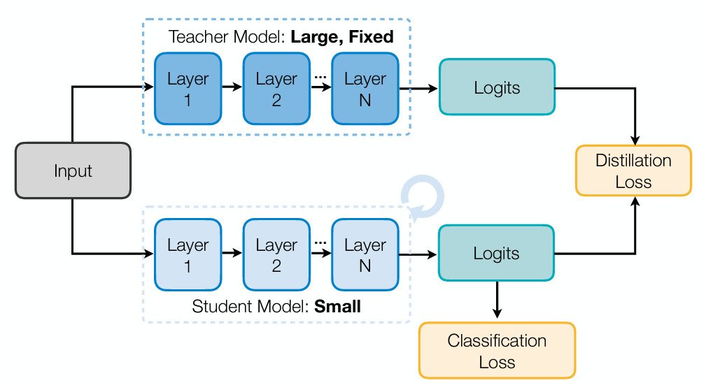
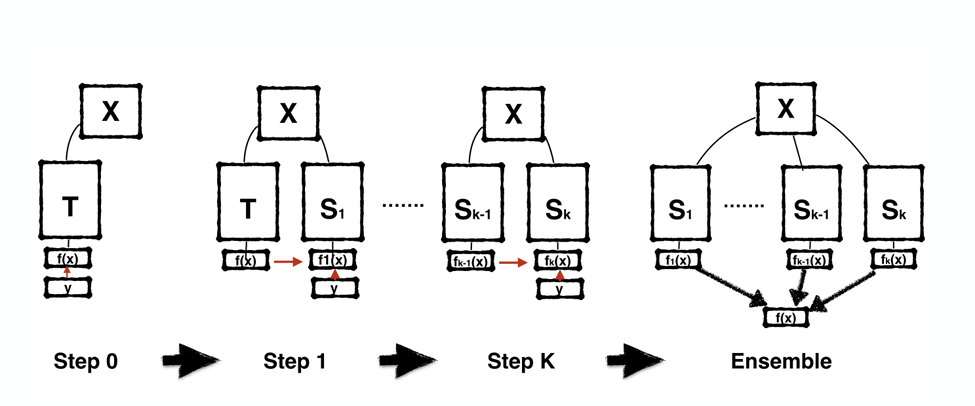
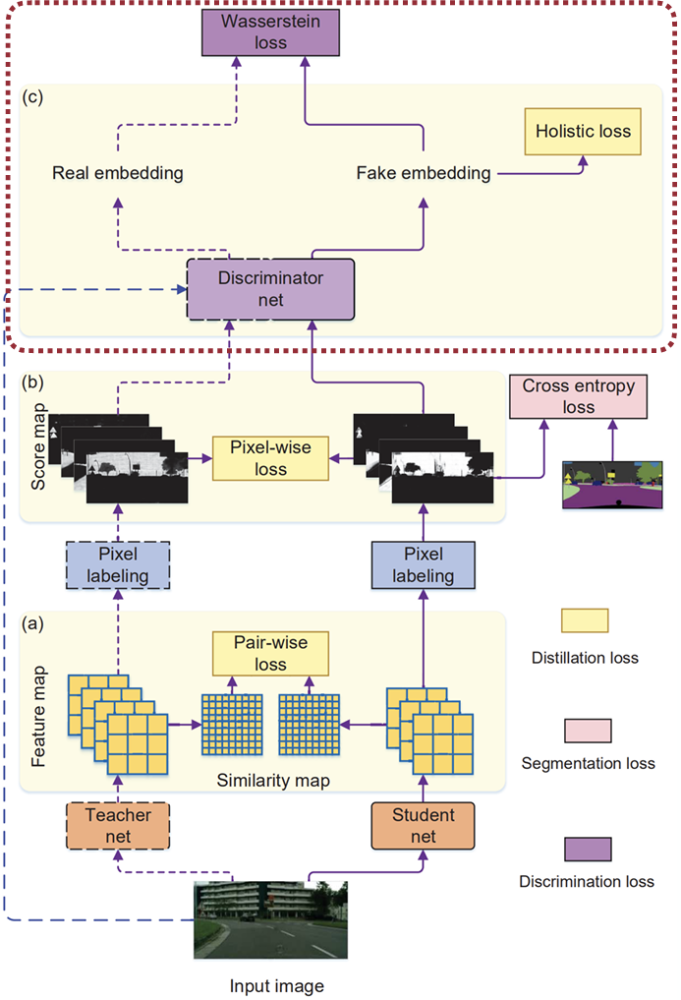
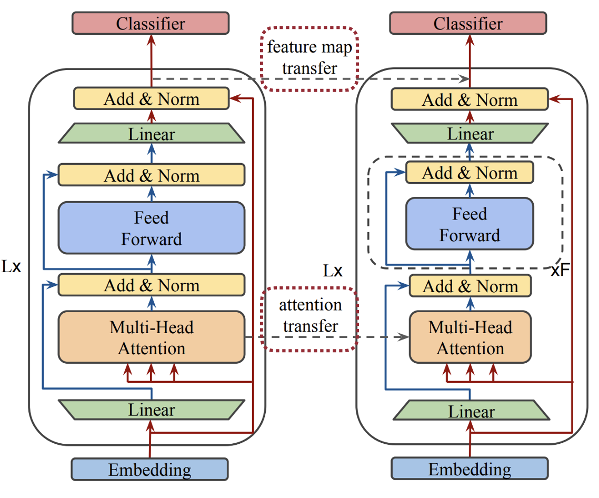
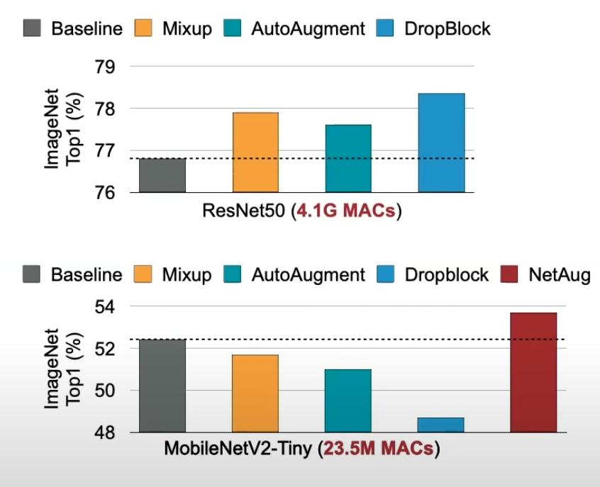

# Lecture 10: Knowledge Distillation

## Note Information

| Title       | Knowledge Distillation                                                   |
|-------------|-----------------------------------------------------------------------------------------------------------------|
| Lecturer    | Song Han|
| Date        | 10/13/2022|
| Note Author | Julian Hamelberg (jshx)|
| Description | Introducing Knowledge Distilation, the concept of matching prediction probabilities between a teacher and a student. |

# Motivation

Due to the limited hardware resources of Tiny AI architectures, Tiny models are hard to train and underfit large datasets

# Overview of knowledge distillation

Given an input, we train a larger Teacher model. Once we've trained the teacher model, it outputs some Logits that represent probabilities of our classification problem. Our goal is to match these probabilities to our student model. So, we train the student model and match different parameters to our fixed teacher model.
# What to match?

## Output Logits

This is the simplest feature to match since it's the output of the model. We can use Cross entropy loss or L2 Loss to match the output logits. 

## Intermediate weights

Try matching the intermediate weights, activations, or predicts from the teacher model to the student model layer by layer.

## Intermediate features

The teacher and student model should have similar feature distributions. This could be accomplished by minimizing the maximum mean discrepancy between feature maps, minimizing the L2 distance between feature maps, etc.

## Gradients

Try matching intermediate gradients of feature maps and attention maps such as learning objective using the attention transfer objective ($\frac{\beta}{2}||J_s-J_T||^2_2$ where $J_s$ is the student attention map, $J_T$ is the teacher attention map and $\beta$ is a constant).

## Sparsity patterns

The teacher and student model should have a similar sparsity pattern, meaning a similar number of zeros after each activation function.

## Relational information

Try matching relational information such as relations between different layers. The output of layer 1 and how it's related to the output of layer 2 in the teacher model should be similar to that of the student model.

# Self Distillation

What if the teacher model wasn't fixed or larger than the student model? Introducing Self Distillation and Born Again Networks. We start with a network architecture for the teacher model that is the same as our student model and use each better model as our teacher model for the next student training. We can also ensemble all of the netweorks to get even better performance.

# Online Distillation

Rather than having a teacher model, what if we had multiple student models learning at the same time, learning from each other. Deep Mutual Learning.

# Combined Distillation

Combine the two previous ideas of Distillation using On the Fly Native Ensemble as the teacher network. Generate multiple output distributions and ensemble them as the target distribution for KD.

# Distillation for Other Applications

## KD for Object Detection

For object detection, we want to make sure to match intermediate activations. We can match the shape of the feature map, use different weights for foreground and background classes to handle class imbalance, and use the teacher's prediction as an upperbound for the student.

We can also convert bounding box regression to a classification problem by convertiong the x and y axis into a number of bins

## KD for Semantic Segmentation

We can add a discriminator network to provide adversarial loss.
The student model is then trained to make the network unable to tell if the image came from the teacher or the student

## KD for GAN

We can train using a fraction of the number of channels by training the teacher and using various loss functions to go from the teacher intermediate maps to the student intermediate maps

## KD for NLP

We can train the student model to mimic tthe attenion maps 

# Network Augmentation

## Conventional Approach

Generally, we augment the data during training to avoid overfit. We could cut out a piece of the data, max our data with other data, or some other methods of augmentation

However, we don't have the number of MACs required for ResNet to get 70% accuracy on networks with less capacity like MobileNet, so this approach hurts tiny models

## Network Augmentation

Instead, we can augment the network itself by building an augmented model that shares weights with the original network.
We go forwards and backwards on both models, we calculate the gradient using the sum of the base and the auxilary. For each iteration, we can use a different subset of the augmented network to calculate the loss.

NetAug improves the training accuracy and validation accuracy for tiny networks, and improves the training accuracy for large networks, but hurts the validation accuracy for large networks.