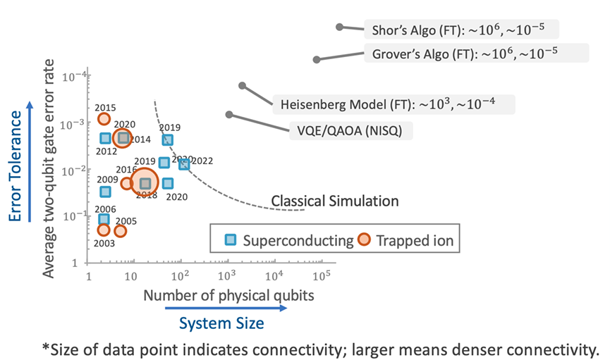
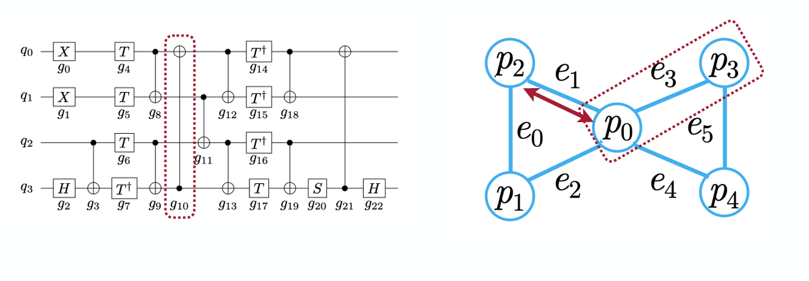
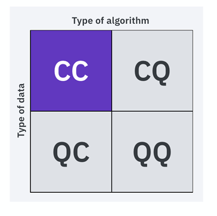
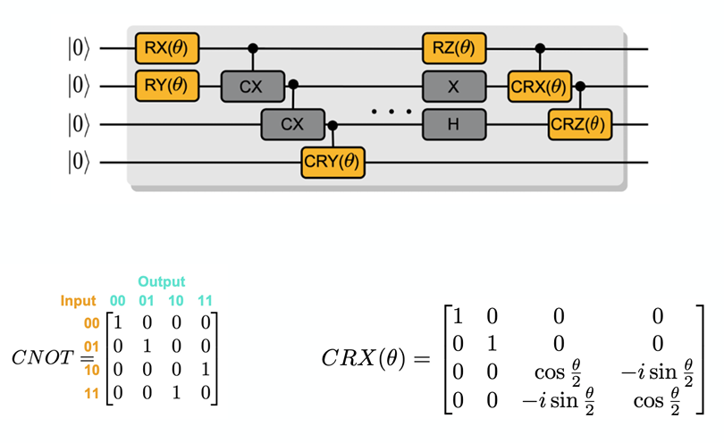
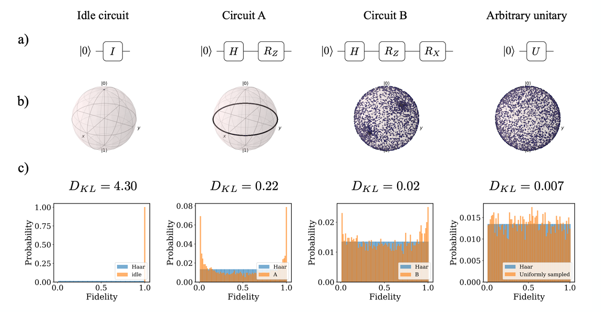
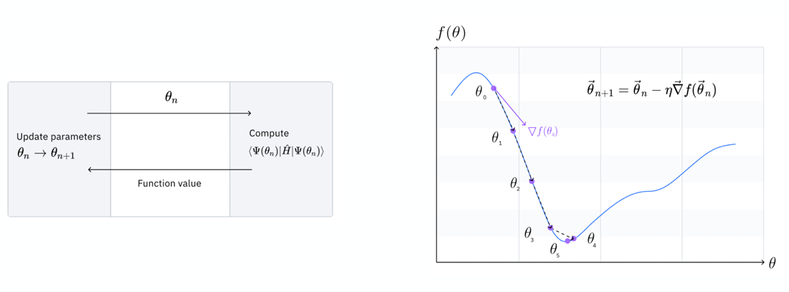
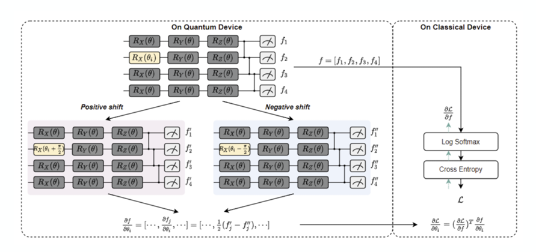
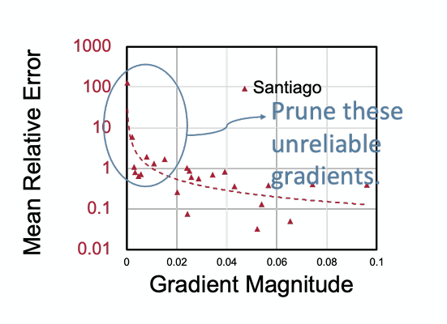
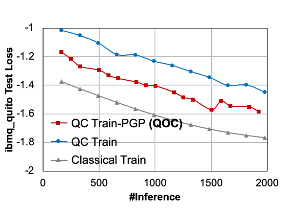

# Lecture 22: Quantum Machine Learning Part I

## Note Information

| Title       | Quantum Machine Learning                                                   |
|-------------|-----------------------------------------------------------------------------------------------------------------|
| Lecturer    | Hanrui Wang, Song Han|
| Date        | 11/29/2022|
| Note Author | Julian Hamelberg (jshx)|
| Description | An introduction to Quantum Machine Learning and techniques to perform machine learning tasks on quantum devices |

# Continue NISQ Devices

Noisy Intermediate-Scale Quantum describes devices that are sensitive to the environment (noisy) which yields unreliable quantum gates. There are a limted number of qubits and limited connectivity between them (no all-to-all connections)

## Gap between the Algorithm and Device

Unfortunately, even the most recent quantum devices (blue superconducting) cannot be used for the most important applications due to the high number of qubits required.

## Qubit Mapping

There are many choices allowed when desiging a qubit mapping of a problem due to the large amount of connections and swaps that can occur. Work is being done with mapping and NP-Complete problems.

# Introduction to Machine Learning

## Quantum Machine Learning Approaches

There are 4 types of quantum machine learning approaches depending on the type of data we have and the type of alogorithm we want to use.

-Classical Data, Classical Algorithm is the type of machine learning techniques covered in previous lectures.

-Classical Data, Quantum Algorihm is using quantum techniques on our data.

-Quantum Data, Classical Algorithm is using our classic approaches on quantum data to do things such as reading out qubits, qubit control, calibration, etc.

-Quantum Data, Quantum Algorithm is using quantum machines to process quantum data, no need to transpose to or from the classical domain.

## Parameterized Quantum Circuits

The circuit contains fixed gates and parameterized gates

We define the *Expressivity* of a quantum circuit as how much it covers the Hilbert space and the extent the states generated from the circuit deviate from the uniform distribution.

The more right we go, the more expressive the circuit

## Entanglement Capability

The Meyer-Wallach measure tells us how entangled a given state is from unentangled (0) to full entangled (1). We can use averaged MW to measure the entanglement capability of a quantum circuit

## Hardware Efficiency

We should consider the hardware efficiency to make sure noise is low when designing circuits. Qubit Connectivity is important in hardware efficiency.

## Data Encoding

To use classical data in a quantum device, we have to encode the data to the quantum space.

-Basis Encoding is similar to binary representation whereas we create a quantum state that holds two qubits to represent the space. It's not efficient for encoding one data at a time, but it can be used to represent multiple data at the same time.

-Amplitude Encoding where the numbers are encoded as a statevector of the qubits so for $N$ features, you only need $\log N$ qubits. HOwever, it has poor scalability.

## Angle Encoding

Scalable. Encode the data as rotation angles of the quibit gates.

## Arbitrary Encoding

We just design an arbitrary parameterized quantum circuit and use input data as the rotation angles.

# Parameterized Quantum Circuit Training

Train parameters in PQC to perform data-driven tasks. Similar to a classical approach, we train parameters and compute a cost function, in the quantum case, we are iteratively updating the parameters using gradients or compute some function. We can even utilize gradient descent.

We can use Finite Difference Gradient to compute any arbitrary gradients. However, it's only an approximation.

We can use Parameter-Shift Gradient to compute analytical gradients.

To parameter-shift, we first calculate the gradient of $\theta$ with respect to $f(\theta)$, then we shift $\theta$ in the positive direction by $\pi/2$, then in the negative direction by $\pi/2$ we get the analytical value of the gradient.

## Back Propagation

The gradients can also be calculated using back propogation but only in a classical context because quantum devices cannot get intermediate data from the readings. All the operations of back-prop are essentially differentiable linear algebra, so easy to compute.

## General Flow to calculate PQC gradients

1. Run on quantum circuit without shift to get the $f$
2. Further forward (for example post processing of result) to get Loss
3. Back-prop to calculate $\frac{\partial \text{Loss}}{\partial f(\theta)}$
4. Shift positive and negative on run on quantum circuit to calculate $\frac{\partial f(\theta)}{\partial \theta_i}$ OR
 Use finite differentiate
5. Calculate Loss using the chain rule $\frac{\partial \text{Loss}}{\partial f(\theta)} \cdot \frac{\partial f(\theta)}{\partial \theta_i} = \frac{\partial \text{Loss}}{\partial \theta_i}$ and sum over number of qubits different passes

# Training Techniques

## Simultaneous Perturbation Stochastic Approximation (SPSA)

Normally we have to run the circuit twice and calculate the dimensions twice, but with SPSA, we can do this all together. If we do the pertrubation of all the parameters together and assume it converges similarlly to do SPSA.

## Barren Plateaus

Another limitation of PQCs. When the circuit get very large it's more difficult to propogate the gradients to the parameters 

# Quantum Classifiers

When given a problem we can encode it however we need. We then train on quantum layers. And finally get our result.

## PQC for other tasks

Variational Quantum Eigensovler (VQE) we take a circuit and we create an optimization problem where we want to minimize (like finding a smallest eigenvalue)
Quantum Approximate Optimization Algorithm (QAOA) are algoritms that do some combinatorial optimization problem

# Noise Aware On-Chip Training

We leverage noise mitigation to make sure that circuit, vqe, or qaoa that we train is robust to nosie, because noise reduces the reliability of on-chip computed gradients.
Small nmagnitude gradients have large relative errors. So we prune the unreliable gradients to not worry about their relative errors and not use it to calculate the parameters.

We create accumulation and pruning windows that interleave possibily unreliable gradients, then prune the unreliable gradients in the pruning window. The accumulation of the gradients if high shows the reliablity of the gradients. The pruning window works better when using a probablisitic reliability rather than a deterministic reliability, so we prune according the a probability distribution.

Using the PQC on MNIST classification, the gradient achieves similar results to the classical simulation

Gradient pruning can bring 2-4% accuracy improvments and reduce the gap between quantum and classical. 

Probablistic Pruning provides better results than deterministic pruning and allows for faster convergence.

# Torch Quantum

Torch Quantum enables ML-assited hardware aware quantum algorithm design. It's fast, convenient (Pytorch native), portable, scalable. It has good infrastructure.
